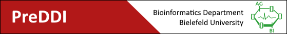

## Data sources
| PMID                                                     | Title                                                                                                        | Scoring               |
|:---------------------------------------------------------|--------------------------------------------------------------------------------------------------------------|-----------------------|
| [22647690](https://www.ncbi.nlm.nih.gov/pubmed/22647690) | Drug-drug interaction through molecular structure similarity analysis                                        | Tanimoto coefficient  |
| [23520498](https://www.ncbi.nlm.nih.gov/pubmed/23520498) | Detection of Drug-Drug Interactions by Modeling Interaction Profile Fingerprints                             | Tanimoto coefficient  |
| [24158091](https://www.ncbi.nlm.nih.gov/pubmed/24158091) | Mining clinical text for signals of adverse drug-drug interactions                                           | population event rate |
| [26196247](https://www.ncbi.nlm.nih.gov/pubmed/26196247) | Label Propagation Prediction of Drug-Drug Interactions Based on Clinical Side Effects                        | Tanimoto coefficient  |
| [27354693](https://www.ncbi.nlm.nih.gov/pubmed/27354693) | A probabilistic approach for collective similarity-based drug–drug interaction prediction                    | -                     |
| [28056782](https://www.ncbi.nlm.nih.gov/pubmed/28056782) | Predicting potential drug-drug interactions by integrating chemical, biological, phenotypic and network data | -                     |

## Pipeline

1. Download from [DrugBank](https://drugbank.ca/releases/latest) and extract under `data/DrugBank/`:  
  1.1. `drugbank_all_full_database.xml.zip` to `full database.xml`  
  1.2. `drugbank_all_drug_links.csv.zip` to `drug links.csv`
2. Run `main.py`

## Statistics

### Mapping of source data to DrugBank IDs
| PMID                                                     |   Matched |   Duplicated |   Unmatched |
|:---------------------------------------------------------|----------:|-------------:|------------:|
| [22647690](https://www.ncbi.nlm.nih.gov/pubmed/22647690) |      8367 |         8385 |         344 |
| [23520498](https://www.ncbi.nlm.nih.gov/pubmed/23520498) |      3820 |        13286 |         130 |
| [24158091](https://www.ncbi.nlm.nih.gov/pubmed/24158091) |      4885 |         1098 |           0 |
| [26196247](https://www.ncbi.nlm.nih.gov/pubmed/26196247) |    118614 |         6861 |       19593 |
| [27354693](https://www.ncbi.nlm.nih.gov/pubmed/27354693) |      1989 |         1989 |           0 |
| [28056782](https://www.ncbi.nlm.nih.gov/pubmed/28056782) |      1000 |            0 |           0 |
